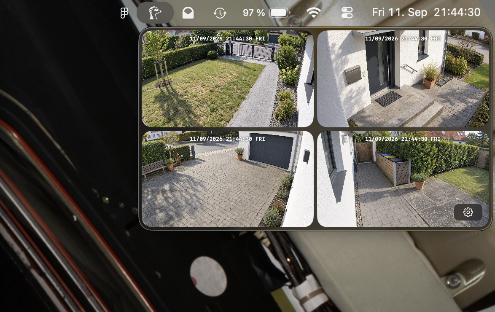

# Meerkat

Peek at your cameras from the menu bar. Instantly.



Meerkat is a macOS menu bar app that plays a live grid of Reolink (and more providers in the future) camera streams in a small window triggered from the menu bar icon. The app is designed to be lightweight and fast, and to use minimal resources.

The stream connections are kept open in the background so the panel can show the livestream instantly.

## Installation

### Download

Get the latest universal DMG from the releases page, open it, and drag Meerkat to your Applications folder.

The app updates itself in place via signed, notarized Sparkle updates. Requires macOS 26 (Tahoe) or later.

## Supported Cameras

Currently supported cameras:
- Reolink (tested with RLC-520A and RLC-810A)

Right now it's just tested with Reolink cameras, more cameras will be officially supported in the future. Nothing is stopping you from adding other cameras yourself if they provide an HTTP-FLV stream. Just put in the camera's IP address, username, and password and if the stream is available, it will be shown in the app like the Reolink cameras.

## Usage

Add a camera in Settings by clicking "Add camera". Enter the camera's IP address, username, and password if required.

## Development

Clone the repository and open the project in Xcode. Build and run the app to see the live grid.

Build and run the app with:
```sh
xcodebuild -project Meerkat.xcodeproj -scheme Meerkat build
xcodebuild -project Meerkat.xcodeproj -scheme Meerkat run
```

Run camera-independent tests with:

```sh
xcodebuild -project Meerkat.xcodeproj -scheme Meerkat -only-testing:MeerkatTests test
```

## Contributing

Contributions are always welcome! Please open an issue or pull request. If you have a camera that is not on the official supported list, but works with Meerkat, please open an issue and I'll add it to the list.

## License

MIT.
