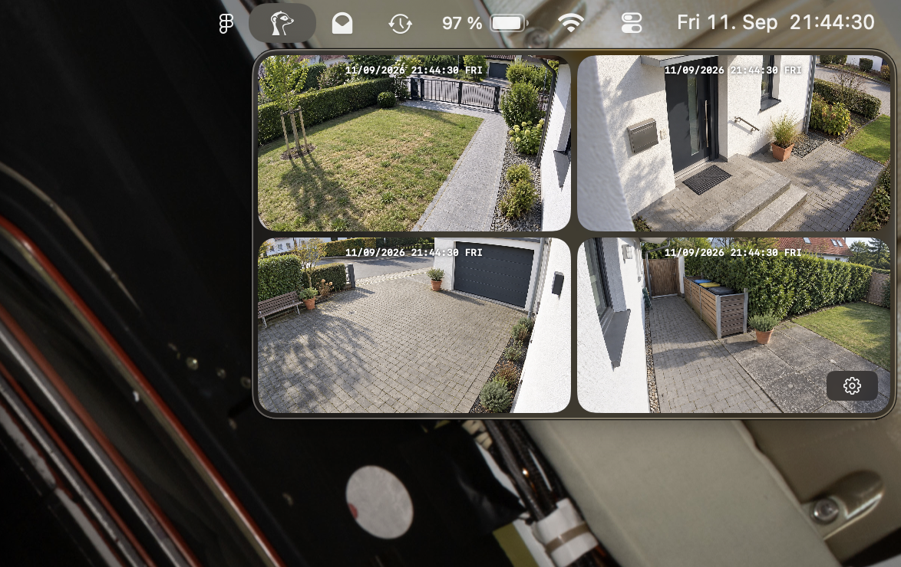

# Meerkat

Peek at your cameras from the menu bar. Instantly.



Meerkat is a macOS menu bar app that plays a live grid of Reolink, Tapo, and Eufy camera streams in a small window triggered from the menu bar icon. The app is designed to be lightweight and fast, and to use minimal resources.

By default, stream connections stay open in the background so the panel can show live video instantly. You can turn off background streaming in Settings to disconnect cameras while the panel is closed.

## Installation

### Download

Get the latest universal DMG from the [releases page](https://github.com/exddc/meerkat/releases/latest), open it, and drag Meerkat to your Applications folder.

The app updates itself in place via signed, notarized Sparkle updates. Requires macOS 26 (Tahoe) or later.

## Supported Cameras

Supported camera streams:

- Reolink over HTTPS-FLV (tested with RLC-520A and RLC-810A)
- Tapo over RTSP (`/stream1` and `/stream2`)
- Eufy over RTSP (`/live0` and `/live1`)

Enable RTSP on Tapo and Eufy cameras that support it and use the camera's stream credentials. You can also enter a complete HTTPS-FLV or RTSP stream URL. For local testing, use the [camera mock server](mock/README.md).

## Usage

Add a camera in Settings by clicking "Add camera". Enter the camera's IP address, username, and password if required.

Use the visibility toggle beside each camera to show or hide it in the grid. Duplicate a camera in Settings to reuse its connection details. Enable "Start Meerkat at login" to start Meerkat when you sign in.

## Development

Clone the repository and open the project in Xcode. Build and run the app to see the live grid.

Build the app with:
```sh
xcodebuild -project Meerkat.xcodeproj -scheme Meerkat build
```

Run camera-independent tests with:

```sh
xcodebuild -project Meerkat.xcodeproj -scheme Meerkat -only-testing:MeerkatTests test
```

Generate CPU, memory, and long-running impact metrics from an optimized build with:

```sh
scripts/generate-metrics.sh --duration 5m --label background-one-camera
```

See [Metrics](docs/metrics.md) for scenarios, output fields, and comparison guidance.

## Contributing

Contributions are always welcome! Please open an issue or pull request. If you have a camera that is not on the official supported list, but works with Meerkat, please open an issue and I'll add it to the list.

## License

MIT.
